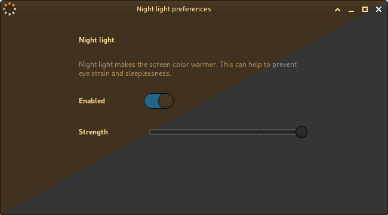

# Xings Night Light Daemon

Xings Night Light Daemon is a daemon that allows you to change the color temperature of the screen.

It is intended to be kept simple and useful for all desktops that do not have this feature natively.

The main code is based on:

 * https://github.com/faf0/sct

## Screenshots

## Limitations

 * Xings Night Light Daemon only works on X11/Xorg with the XRandr extension.
